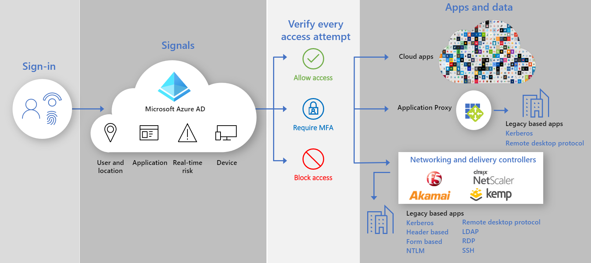

# Безопасный гибридный доступ: защищенные устаревшие приложения с Azure Active Directory

Теперь вы можете защитить локальные и облачные приложения проверки подлинности, подключив их к Azure Active Directory (AD) с помощью:

- [AD Application Proxy Azure](#secure-hybrid-access-sha-through-azure-ad-application-proxy)

- [Существующие контроллеры и сети доставки приложений](#sha-through-networking-and-delivery-controllers)

- [Приложения виртуальной частной сети (VPN) и Software-Defined периметра (SDP)](#sha-through-vpn-and-sdp-applications)

Вы можете преодолеть разрыв и усилить уровень безопасности для всех приложений с помощью таких возможностей Azure AD, как [Условный доступ](../conditional-access/overview.md) Azure AD и [Защита идентификации](../identity-protection/overview-identity-protection.md)Azure AD.

## Безопасный гибридный доступ (SHA) через Azure AD Application Proxy
  
С помощью [прокси приложения](./what-is-application-proxy.md) можно обеспечить [безопасный удаленный доступ](./application-proxy.md) к локальным веб-приложениям. Пользователи не должны использовать VPN. Пользователи получают возможность легко подключаться к своим приложениям с любого устройства после [единого входа](./add-application-portal-setup-sso.md). Прокси приложения предоставляет удаленный доступ как службу и позволяет [легко публиковать локальные приложения](./application-proxy-add-on-premises-application.md) для пользователей за пределами корпоративной сети. Она помогает масштабировать управление облачным доступом без необходимости вносить изменения в локальные приложения. [Планирование развертывания AD application proxy Azure](./application-proxy-deployment-plan.md) в качестве следующего этапа.

## Интеграция с партнерами Azure AD

### SHA через сети и контроллеры доставки

В дополнение к [Azure AD application proxy](./what-is-application-proxy.md), чтобы использовать [инфраструктуру с нулевым доверием](https://www.microsoft.com/security/blog/2020/04/02/announcing-microsoft-zero-trust-assessment-tool/), партнеры Майкрософт со сторонними поставщиками. Вы можете использовать существующие сетевые устройства и контроллеры доставки, а также легко защищать устаревшие приложения, которые важны для бизнес-процессов, но не смогли обеспечить защиту перед использованием Azure AD. Скорее всего, у вас уже есть все необходимое для защиты этих приложений.

Следующие поставщики сетей предлагают готовые решения и подробные рекомендации по интеграции с Azure AD.

- [Доступ к корпоративному приложению Akamai (EAA)](https://docs.microsoft.com/azure/active-directory/saas-apps/akamai-tutorial)

- [Контроллер доставки приложений Citrix (ADC)](https://docs.microsoft.com/azure/active-directory/saas-apps/citrix-netscaler-tutorial)

- [F5 Big-IP APM](https://docs.microsoft.com/azure/active-directory/saas-apps/headerf5-tutorial)

- [Kemp](https://docs.microsoft.com/azure/active-directory/saas-apps/kemp-tutorial)

- [Диспетчер импульсной защиты виртуального трафика (ВТМ)](https://docs.microsoft.com/azure/active-directory/saas-apps/pulse-secure-virtual-traffic-manager-tutorial)

### SHA через VPN и SDP-приложения

Используя решения VPN и SDP, вы можете в любое время обеспечить безопасный доступ к корпоративной сети с любого устройства в любой момент, одновременно защищая данные Организации. Используя Azure AD в качестве поставщика удостоверений (IDP), вы можете использовать современные методы проверки подлинности и авторизации, такие как [единый вход](./what-is-single-sign-on.md) Azure AD и [многофакторная идентификация](../authentication/concept-mfa-howitworks.md) , для защиты локальных приложений прежних версий.  

Следующие поставщики VPN предлагают предварительно созданные решения и подробные рекомендации по интеграции с Azure AD.

- [Cisco AnyConnect](https://docs.microsoft.com/azure/active-directory/saas-apps/cisco-anyconnect)

- [Fortinet](https://docs.microsoft.com/azure/active-directory/saas-apps/fortigate-ssl-vpn-tutorial)

- [F5 Big-IP APM](https://docs.microsoft.com/azure/active-directory/manage-apps/f5-aad-password-less-vpn)

- [Глобальная защита Palo Alto Networks](https://docs.microsoft.com/azure/active-directory/saas-apps/paloaltoadmin-tutorial)

- [Pulse Secure Pulse Connect (компьютеры)](https://docs.microsoft.com/azure/active-directory/saas-apps/pulse-secure-pcs-tutorial)

Следующие поставщики SDP предлагают готовые решения и подробные рекомендации по интеграции с Azure AD.

- [Брокер доступа датавиза](https://docs.microsoft.com/azure/active-directory/manage-apps/add-application-portal-setup-oidc-sso)

- [Perimeter 81](https://docs.microsoft.com/azure/active-directory/saas-apps/perimeter-81-tutorial#:~:text=For%20SSO%20to%20work,%20you%20need%20to%20establish,to%20test%20Azure%20AD%20single%20sign-on%20with%20B.Simon.)

- [Платформа проверки подлинности силверфорт](https://docs.microsoft.com/azure/active-directory/manage-apps/add-application-portal-setup-oidc-sso)

- [Strata](https://docs.microsoft.com/azure/active-directory/saas-apps/maverics-identity-orchestrator-saml-connector-tutorial)

- [Zscaler Private Access (ZPA)](https://docs.microsoft.com/azure/active-directory/saas-apps/zscalerprivateaccess-tutorial)
