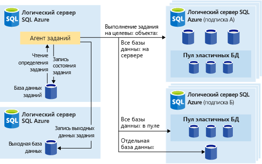

# Автоматизация задач управления с помощью Заданий обработки эластичных баз данных (предварительная версия)

[!INCLUDE[appliesto-sqldb](../includes/appliesto-sqldb.md)]

Вы можете создавать и планировать задания обработки эластичных баз данных, с помощью которых можно периодически выполнять запросы Transact-SQL (T-SQL) и задачи по обслуживанию для одной или нескольких баз данных SQL Azure. 

Вы можете определить целевую базу данных или группы баз данных, в которых будет выполняться задание, а также определить расписания для запуска задания.
Задание выполняет задачу входа в целевую базу данных. Вы также можете определять, поддерживать и сохранять сценарии Transact-SQL, которые могут выполняться в группе баз данных.

Каждое задание регистрирует состояние выполнения и автоматически пытается повторить выполнение операции при возникновении сбоев.

## В каких случаях следует использовать задания обработки эластичных баз данных

Есть несколько сценариев автоматизации с применением заданий обработки эластичных баз данных:

- Автоматизация задач управления, а также их добавление в расписание для запуска каждый рабочий день, в нерабочие часы и т. д.
  - Развертывание изменений схемы, учетных данных, сбора данных о производительности или телеметрии клиента.
  - Обновление эталонных данных (например, сведений о продукте, которые являются общими для всех баз данных), загрузка данных из хранилища BLOB-объектов Azure.
- Настройка заданий для выполнения в коллекции баз данных на постоянной основе, например в часы наименьшей нагрузки.
  - Собирайте результаты запросов из набора баз данных в центральную таблицу на постоянной основе. Запросы производительности могут выполняться непрерывно и вызывать дополнительные задачи.
- Сбор данных для отчетов
  - Сбор данных из коллекции баз данных в одну целевую таблицу.
  - Выполняйте запросы обработки данных с повышенным временем выполнения для большого набора баз данных, например коллекции телеметрии клиентов. Результаты собираются в одну целевую таблицу для дальнейшего анализа.
- Перемещения данных 

### Автоматизация на других платформах

Рассмотрим следующие технологии планирования заданий на разных платформах:

- **Задания обработки эластичных баз данных.** Службы планирования заданий, выполняющие пользовательские задания для одной или нескольких баз данных в Базе данных SQL Azure.
- **Задания Агента SQL.** Выполняются службой Агента SQL, которая по-прежнему используется для автоматизации задач в SQL Server и также входит в состав Управляемого экземпляра SQL Azure. Задания агента SQL недоступны в Базе данных SQL Azure.

Задания обработки эластичных баз данных можно ориентировать на [базы данных SQL Azure](sql-database-paas-overview.md), [пулы эластичных баз данных SQL Azure](elastic-pool-overview.md) и базы данных SQL Azure в [картах сегментов](elastic-scale-shard-map-management.md).

Для автоматизации заданий выполнения скриптов T-SQL в SQL Server и Управляемом экземпляре SQL Azure рекомендуем использовать [Агент SQL](job-automation-managed-instances.md). 

Для автоматизации заданий выполнения скриптов T-SQL в Azure Synapse Analytics рекомендуем использовать [конвейеры с повторяющимися триггерами](../../synapse-analytics/data-integration/concepts-data-factory-differences.md), которые [работают на основе Фабрики данных Azure](../../synapse-analytics/data-integration/concepts-data-factory-differences.md).

Стоит отметить различия между Агентом SQL (доступным в SQL Server и как часть Управляемого экземпляра SQL) и агентом Заданий обработки эластичных баз данных (который может выполнять T-SQL в Базе данных SQL Azure или базах данных в SQL Server и Управляемом экземпляре SQL Azure, Azure Synapse Analytics).

| |Задания обработки эластичных баз данных |Агент SQL |
|---------|---------|---------|
|**Область действия** | Любое количество баз данных в Базе данных Azure SQL и/или хранилищ данных в том же облаке Azure, где расположен агент заданий. Целевые базы данных могут находиться на разных серверах, в разных подписках или регионах.   Целевые группы могут состоять из отдельных баз данных или хранилищ данных либо всех баз данных на сервере, в пуле или карте сегментов (динамически перечисляемых во время выполнения задания). | Любая отдельная база данных в том же экземпляре, что и агент SQL. Функция многосерверного администрирования Агента SQL Server позволяет основным и целевым экземплярам координировать выполнение заданий. Эта функция недоступна в управляемом экземпляре SQL. |
|**Поддерживаемые API и средства** | Портал, PowerShell, T-SQL, Azure Resource Manager | T-SQL, SQL Server Management Studio (SSMS) |
 
## Цели Заданий обработки эластичных баз данных

**Задания обработки эластичных баз данных** позволяют одновременно запускать один или несколько скриптов T-SQL в большом количестве баз данных по расписанию или по требованию.

Вы можете запускать запланированные задания в любой комбинации баз данных: одной или нескольких отдельных базах данных, всех базах данных на сервере, всех базах данных в эластичном пуле или карте сегментов с дополнительной гибкостью, позволяющей включить или исключить любую конкретную базу данных. Задания могут выполняться на нескольких серверах, в нескольких пулах и даже в базах данных в разных подписках. Серверы и пулы динамически перечисляются во время выполнения, поэтому задания выполняются во всех базах данных, имеющихся в целевой группе на момент выполнения.

На следующем изображении показан агент задания, выполняющий задания в разных типах целевых групп:

### Компоненты заданий обработки эластичных баз данных

|Компонент | Описание (дополнительные сведения приведены после таблицы) |
|---------|---------|
|[**Агент заданий обработки эластичных баз данных**](#elastic-job-agent) | Ресурс Azure, созданный для выполнения заданий и управления ими. |
|[**База данных заданий**](#elastic-job-database) | База данных в Базе данных SQL Azure, которую агент заданий использует для хранения данных, связанных с заданиями, определений заданий и т. д. |
|[**Целевая группа**](#target-group) | Набор серверов, пулов, баз данных и карт сегментов, в которых требуется выполнить задания. |
|[**Задание**](#elastic-jobs-and-job-steps) | Задание — это единица работы, состоящая из одного или нескольких шагов. Шаги задания указывают скрипт T-SQL для запуска, а также другие сведения, необходимые для выполнения скрипта. |

#### Агент заданий обработки эластичных баз данных

Агент заданий обработки эластичных баз данных является ресурсом Azure для создания, запуска заданий и управления ими. Агент заданий обработки эластичных баз данных — это ресурс Azure, который вы создаете на портале ([PowerShell](elastic-jobs-powershell-create.md) и REST также поддерживаются).

Для создания **агента заданий обработки эластичных баз данных** требуется наличие базы данных в Базе данных SQL Azure. Агент настраивает эту существующую базу данных SQL Azure в качестве [*базы данных заданий*](#elastic-job-database).

Агент заданий обработки эластичных баз данных является бесплатным. Счета за использование базы данных заданий выставляются по тем же тарифам, что и за использование любой базы данных в Базе данных SQL Azure.

#### База данных заданий обработки эластичных баз данных

*База данных заданий* используется для определения заданий, а также отслеживания состояния и истории их выполнения. *База данных заданий* также используется для хранения метаданных агента, журналов, результатов, определений заданий, а также содержит множество полезных хранимых процедур и других объектов базы данных для создания, запуска заданий и управления ими с использованием T-SQL.

В текущей предварительной версии для создания агента заданий обработки эластичных баз данных требуется существующая база данных в Базе данных SQL Azure (с уровнем обслуживания S0 или выше).

*База данных заданий* должна быть чистой, пустой и иметь цель служб Базы данных SQL Azure S0 или выше. Рекомендуемая цель служб для *базы данных заданий* — S1 или выше, однако оптимальный выбор зависит от уровня производительности, требуемого для заданий: количества шагов в задании, число целевых объектов и частоты выполнения заданий. 

Если операции с базой данных заданий выполняются медленнее, чем ожидалось, то производительность базы данных и использование ресурсов в базе данных заданий в периоды медленной работы нужно [отслеживать](monitor-tune-overview.md#azure-sql-database-and-azure-sql-managed-instance-resource-monitoring) с помощью портала Azure или динамического административного представления [sys.dm_db_resource_stats](/sql/relational-databases/system-dynamic-management-views/sys-dm-db-resource-stats-azure-sql-database). Если использование ресурса, например ЦП, операций ввода-вывода данных или записи журнала, приближается к 100 % и сопоставляется с периодами медленной работы, рассмотрите возможность постепенного масштабирования базы данных до более высоких целей обслуживания (в [модели DTU](service-tiers-dtu.md) или в [модели vCore](service-tiers-vcore.md)), пока производительность базы данных заданий не увеличится.

##### Разрешения базы данных заданий обработки эластичных баз данных

Во время создания агента заданий в *базе данных заданий* создаются схема, таблицы и роль *jobs_reader*. Роль создается со следующим разрешением и предназначена для предоставления администраторам более тонкого контроля доступа для мониторинга заданий:

|Имя роли |Разрешения схемы jobs |Разрешения схемы jobs_internal |
|---------|---------|---------|
|**jobs_reader** | SELECT | None |

> [!IMPORTANT]
> Рассмотрите возможные последствия с точки зрения безопасности перед тем, как предоставить доступ к *базе данных заданий* в качестве администратора базы данных. Злоумышленник с разрешениями на создание или редактирование заданий может создать или редактировать задание, которое использует сохраненные учетные данные для подключения к базе данных под контролем злоумышленника, что позволяет ему определять пароль учетных данных.

#### Целевая группа

*Целевая группа* определяет набор баз данных, в которых будет выполняться шаг задания. Целевая группа может содержать любое количество следующих комбинаций:

- **Логический сервер SQL Server** — если указан сервер, все базы данных, существующие на сервере во время выполнения задания, являются частью группы. Учетные данные главной базы данных должны быть предоставлены таким образом, чтобы группа могла быть перечислена и обновлена ​​до выполнения задания. Дополнительные сведения см. в статье [Что собой представляет логический сервер SQL Server в Базе данных SQL Azure и Azure Synapse](logical-servers.md).
- **Эластичный пул** — если указан эластичный пул, все базы данных, находящиеся в нем во время выполнения задания, являются частью группы. Как и для сервера, учетные данные базы данных master должны быть предоставлены таким образом, чтобы группа могла быть обновлена ​​до выполнения задания.
- **Единственная база данных** — укажите одну или несколько отдельных баз данных, которые будут частью группы.
- **Карта сегментов** — базы данных карты сегментов.

> [!TIP]
> В момент выполнения задания *динамическое перечисление* повторно оценивает набор баз данных в целевых группах, включающих серверы или пулы. Динамическое перечисление гарантирует, что **задание выполняется во всех базах данных, существующих на сервере, или в пуле во время выполнения задания**. Повторная оценка списка баз данных во время выполнения особенно полезна для сценариев, в которых часто происходит изменение членства пула или сервера.

Пулы и отдельные базы данных могут быть указаны как включенные или исключенные из группы. Это позволяет создать целевую группу с любой комбинацией баз данных. Например, вы можете добавить сервер в целевую группу, но исключить конкретные базы данных в эластичном пуле (или исключить весь пул).

Целевая группа может содержать базы данных в нескольких подписках в разных регионах. Обратите внимание, что выполнение в разных регионах имеет более высокую задержку, чем выполнение в той же области.

В следующих примерах показано, как различные определения целевых групп динамически перечисляются в момент выполнения задания, чтобы определить, в каких базах данных будет запущено задание:

В **примере 1** показана целевая группа, состоящая из списка отдельных баз данных. Когда шаг задания выполняется с использованием этой целевой группы, действие шага задания будет выполняться в каждой из этих баз данных. 
В **примере 2** показана целевая группа, которая содержит сервер в качестве целевого объекта. Когда шаг задания выполняется с использованием этой целевой группы, осуществляется динамическое перечисление ресурсов сервера, чтобы определить список баз данных, которые в настоящее время находятся на нем. Действие шага задания будет выполнено в каждой из этих баз данных. 
В **примере 3** показана такая же целевая группа, как и в *примере 2*, но отдельная база данных специально исключена. Действие шага задания *не* будет выполнено в исключенной базе данных. 
В **примере 4** показана целевая группа, которая содержит эластичный пул в качестве целевого объекта. Как и в *примере 2*, во время выполнения задания осуществляется динамическое перечисление ресурсов пула, чтобы определить список баз данных в нем.
  

В **примерах 5** и **6** показаны расширенные сценарии, в которых серверы, эластичные пулы и базы данных могут быть объединены с использованием правил включения и исключения. 
В **примере 7** показано, что сегменты в карте сегментов также могут быть оценены во время выполнения задания.

> [!NOTE]
> Целью задания может быть и сама база данных заданий. В этом сценарии база данных заданий обрабатывается так же, как и любая другая целевая база данных. Для этого нужно создать пользователя задания и предоставить ему достаточные разрешения в базе данных заданий, а учетные данные области базы данных для пользователя задания должны существовать в базе данных задания, как и для любой другой целевой базы данных.

#### Задания обработки эластичных баз данных и их этапы

*Задание* — это единица работы, которая выполняется по расписанию или одноразово. Задание состоит из одного или нескольких *шагов*.

Каждый шаг задания определяет сценарий T-SQL для выполнения, одну или несколько целевых групп для запуска сценария T-SQL и учетные данные, которые агент заданий должен подключить к целевой базе данных. На каждом шаге задания настраиваются время ожидания и повторные политики, а также могут указываться выходные параметры.

#### Выходные данные задания

Результаты выполнения шагов задания в каждой целевой базе данных подробно записываются, а выходные данные скрипта можно записать в указанную таблицу. Вы можете указать базу данных для сохранения любых данных, возвращаемых из задания.

#### Журнал заданий

Чтобы просмотреть журнал выполнения заданий обработки эластичных баз данных в *базе данных заданий*, [запросите таблицу jobs.job_executions](elastic-jobs-tsql-create-manage.md#monitor-job-execution-status). Задание очистки системы очищает историю выполнения, которой больше 45 дней. Чтобы удалить историю, которой менее 45 дней, вызовите хранимую процедуру **​​sp_purge_history** в *базе данных заданий*.

#### Состояние задания

Вы можете отслеживать выполнение заданий обработки эластичных баз данных в *базе данных заданий*, [запросив таблицу jobs.job_executions](elastic-jobs-tsql-create-manage.md#monitor-job-execution-status). 

### Производительность, емкость и ограничения агента

В заданиях обработки эластичных баз данных используются минимальные вычислительные ресурсы при ожидании завершения длительных заданий.

В зависимости от размера целевой группы баз данных и требуемого времени выполнения задания (количество одновременных рабочих ролей) агенту требуется разные объемы вычислений и производительности *базы данных заданий* (чем больше целевых объектов и заданий, тем выше требуемый объем вычислений).

Сейчас ограничение составляет 100 параллельных заданий.

#### Предотвращение сокращения производительности заданий целевой базы данных

Чтобы ресурсы не перегружались при работе с базами данных в эластичном пуле SQL, задания можно настроить для ограничения количества баз данных, в которых может одновременно работать задание.

## Дальнейшие действия

- [Управление группами баз данных с помощью заданий эластичных баз данных](elastic-jobs-overview.md)
- [Создание заданий обработки эластичных баз данных и управление ими с помощью PowerShell](elastic-jobs-powershell-create.md)
- [Use Transact-SQL (T-SQL) to create and manage Elastic Database Jobs](elastic-jobs-tsql-create-manage.md) (Создание заданий обработки эластичных БД и управление ими с использованием Transact-SQL (T-SQL))