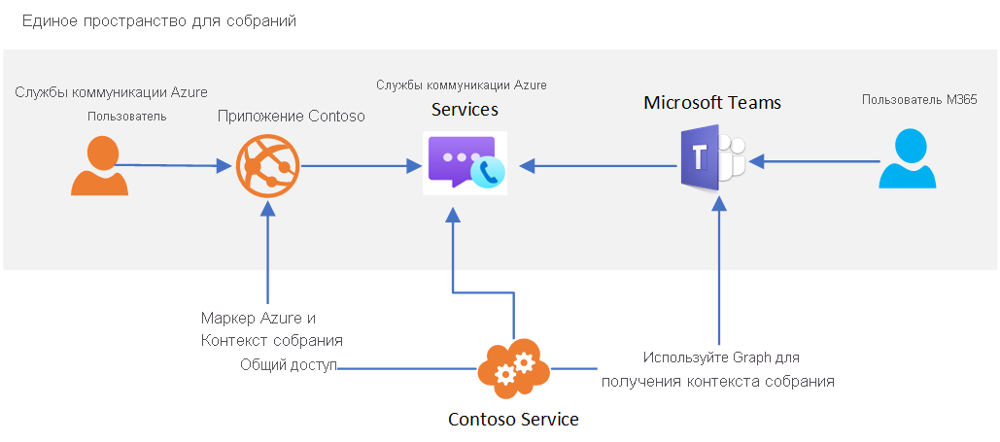

# Взаимодействие с Teams

[!INCLUDE [Private Preview Notice](../includes/private-preview-include.md)]

Службы связи Azure можно использовать для создания пользовательских интерфейсов для конференций, взаимодействующих с Microsoft Teams. Пользователи ваших решений Служб коммуникации могут взаимодействовать с участниками Teams путем голосовой связи и видеосвязи, а также общего доступа к экранам.

Такое взаимодействие с Teams позволяет создавать пользовательские приложения, которые помогают пользователям участвовать в конференциях Teams. Пользователям таких приложений не нужно иметь удостоверения Azure Active Directory или лицензии Teams, чтобы воспользоваться этой возможностью. Это идеальный вариант для того, чтобы собрать вместе сотрудников (которые могут быть знакомы с Teams) и внешних пользователей (использующих интерфейсы своих приложений), чтобы обеспечить бесперебойную работу. Пример.

1. Сотрудники используют Teams для планирования собрания 
1. Сведения о конференции совместно используются внешними пользователями в пользовательском приложении
   * **Использование API Graph** Пользовательское приложение Служб коммуникации использует Microsoft API Graph для получения доступа к сведениям о конференции. 
   * **Использование других вариантов** Например, ссылку на конференцию можно скопировать из своего календаря в Microsoft Teams.
1. Внешние пользователи могут использовать ваше пользовательское приложение, чтобы принять участие в конференции Teams (с использованием клиентских библиотек вызовов и чатов Служб коммуникации).

Архитектура верхнего уровня для этого варианта использования выглядит следующим образом. 

Хотя некоторые функции конференций Teams, такие как поднятая рука, совместный режим и комнаты отдыха, будут доступны только для пользователей Teams, ваше пользовательское приложение будет иметь доступ к основным функциям аудио-, видеосвязи, чатам и возможностям общего доступа к экрану.

Когда пользователь Служб коммуникации присоединяется ко встрече Teams, отображаемое имя, предоставленное через клиентскую библиотеку Calling, будет показано для пользователей Teams. В противном случае пользователь Служб коммуникации будет рассматриваться в Teams как анонимный пользователь.  Пользовательское приложение должно учитывать проверку подлинности пользователей и другие меры безопасности для защиты конференций Teams. Помните о соображениях безопасности, разрешая анонимным пользователям присоединяться к конференциям, и используйте [руководство по безопасности Teams](/microsoftteams/teams-security-guide#addressing-threats-to-teams-meetings) для настройки возможностей, доступных анонимным пользователям.

Функция взаимодействия с Teams в Службах коммуникации сейчас предоставляется в закрытой предварительной версии. Когда эта возможность станет общедоступной, пользователи Служб коммуникации будут рассматриваться как пользователи внешнего доступа. Дополнительные сведения о внешнем доступе см. в статье [Звонки, чат и совместная работа с пользователями за пределами организации в Microsoft Teams](https://docs.microsoft.com/microsoftteams/communicate-with-users-from-other-organizations).

Пользователи Служб коммуникации могут присоединяться к конференциям по расписанию, если в [параметрах конференций](/microsoftteams/meeting-settings-in-teams) включены анонимные подключения.

## Teams в облаке для государственных организаций (GCC)
Сейчас взаимодействие в Службах коммуникации Azure не поддерживается для развертываний Teams с использованием [облаков для государственных организаций Microsoft 365 (GCC)](/MicrosoftTeams/plan-for-government-gcc). 

## Дальнейшие шаги

> [!div class="nextstepaction"]
> [Подключение приложения для звонков к собранию в Teams](../quickstarts/voice-video-calling/get-started-teams-interop.md)
