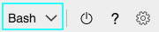

Для работы с этим учебником требуются следующие ресурсы Azure:

* Центр Интернета вещей
* Учетная запись хранения
* Учетная запись Служб мультимедиа Azure
* Виртуальная машина Linux в Azure с установленной [средой выполнения IoT Edge](../../../../../iot-edge/how-to-install-iot-edge.md)

В целях этого краткого руководства мы рекомендуем использовать [сценарий подготовки ресурсов Аналитики видеотрансляций](https://github.com/Azure/live-video-analytics/tree/master/edge/setup) для развертывания необходимых ресурсов в подписке Azure. Для этого выполните следующие действия.

1. Откройте [Azure Cloud Shell](https://ms.portal.azure.com/#cloudshell/).
    > [!div class="mx-imgBorder"]
    > :::image type="content" source="../../../media/quickstarts/cloud-shell.png" alt-text="Cloud Shell":::
1. Если вы используете Cloud Shell впервые, вам будет предложено выбрать подписку для создания учетной записи хранения и общей папки для службы "Файлы Microsoft Azure". Выберите **Create storage** (Создать хранилище), чтобы создать учетную запись для хранения сведений о сеансах Cloud Shell. Эта учетная запись хранения отличается от учетной записи, которая будет создана сценарием для использования с учетной записью Служб мультимедиа Azure.
1. В раскрывающемся меню в левой части окна Cloud Shell выберите в качестве среды **bash**.

    
1. Выполните следующую команду.

    ```
    bash -c "$(curl -sL https://aka.ms/lva-edge/setup-resources-for-samples)"
    ```
    
    Если скрипт завершит работу успешно, вы увидите все необходимые ресурсы в своей подписке. Этот скрипт позволяет настроить в общей сложности 12 ресурсов.
    1. **Конечная точка потоковой передачи** полезна для воспроизведения записанного ресурса AMS.
    1. **Виртуальная машина** будет использоваться в качестве пограничного устройства.
    1. **Диск** хранилища подключается к виртуальной машине для хранения мультимедиа и артефактов.
    1. **Группа безопасности сети** применяется для фильтрации входящего и исходящего трафика ресурсов Azure в виртуальной сети Azure.
    1. **Сетевой интерфейс** позволяет виртуальной машине Azure взаимодействовать с Интернетом, Azure и другими ресурсами.
    1. **Подключение бастиона** позволяет подключаться к виртуальной машине из браузера или с портала Azure.
    1. **Общедоступный IP-адрес** предоставляет ресурсам Azure возможность взаимодействовать с Интернетом и общедоступными службами Azure.
    1. **Виртуальная сеть Azure** позволяет ресурсам Azure различных типов (в том числе виртуальным машинам Azure) обмениваться данными друг с другом, с локальными сетями и Интернетом. См. дополнительные сведения о [виртуальных сетях](https://docs.microsoft.com/azure/virtual-network/virtual-networks-overview).
    1. **Центр Интернета вещей** выполняет роль централизованного концентратора сообщений для двусторонней связи между приложением Интернета вещей, модулями IoT Edge и управляемыми устройствами.
    1. **Учетная запись Служб мультимедиа** помогает управлять содержимым мультимедиа в Azure и выполнять его потоковую передачу.
    1. **Учетная запись хранения** сопоставляется с учетной записью Служб мультимедиа. Необходимо иметь одну основную учетную запись хранения. Допускается любое количество дополнительных учетных записей хранения. Дополнительные сведения см. в статье [Учетные записи хранения Azure с учетными записями Служб мультимедиа Azure](https://docs.microsoft.com/azure/media-services/latest/storage-account-concept).
    1. **Реестр контейнеров** помогает хранить и администрировать частные образы контейнеров Docker и связанные с ними артефакты.
1. Когда сценарий завершит свою работу, щелкните фигурные скобки, чтобы раскрыть структуру папок. В каталоге *~/clouddrive/lva-sample* вы увидите несколько файлов. В этом кратком руководстве нас интересуют указанные ниже файлы.

     * ***~/clouddrive/lva-sample/edge-deployment/.env*** — файл, содержащий свойства, которые Visual Studio Code использует для развертывания модулей на пограничном устройстве.
     * ***~/clouddrive/lva-sample/appsetting.json*** — файл, используемый Visual Studio Code для запуска примера кода.
     
    Эти файлы понадобятся вам при настройке среды разработки в Visual Studio Code в следующем разделе. Пока мы рекомендуем сохранить локальные копии этих файлов.
    
    

> [!TIP]
> Если вы столкнулись с проблемами с созданными ресурсами Azure, ознакомьтесь с нашим **[руководством по устранению неполадок](../../../troubleshoot-how-to.md#common-error-resolutions)** , чтобы решить некоторые часто встречающиеся проблемы.