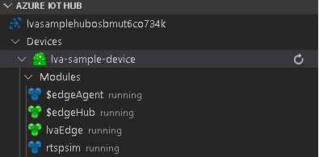

На шаге [Создание и развертывание манифеста развертывания IoT Edge](../../../detect-motion-emit-events-quickstart.md#generate-and-deploy-the-deployment-manifest) в Visual Studio Code, разверните узел **lva-sample-device** в **Центр Интернета вещей Azure** (в разделе слева внизу). Вы должны увидеть развертывание следующих модулей:

* Модуль Аналитики видеотрансляций `lvaEdge`.
* Модуль `rtspsim`, имитирующий RTSP-сервер, выступающий в качестве источника веб-канала видеотрансляции

  

> [!NOTE]
> В приведенных выше шагах предполагается, что вы используете виртуальную машину, созданную с помощью скрипта настройки. Если вы используете собственное пограничное устройство, перейдите на это устройство и выполните следующие команды с **правами администратора**, чтобы извлечь и сохранить пример видеофайла, используемый для этого краткого руководства.  

```
mkdir /home/lvaedgeuser/samples
mkdir /home/lvaedgeuser/samples/input    
curl https://lvamedia.blob.core.windows.net/public/camera-300s.mkv > /home/lvaedgeuser/samples/input/camera-300s.mkv  
chown -R lvalvaedgeuser:localusergroup /home/lvaedgeuser/samples/  
```
