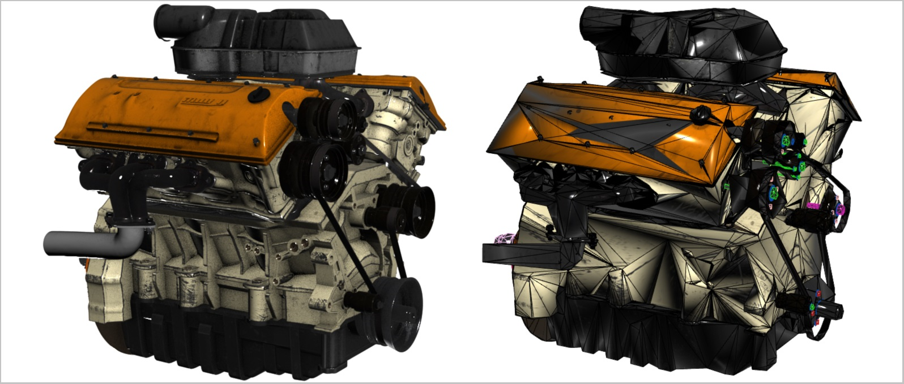
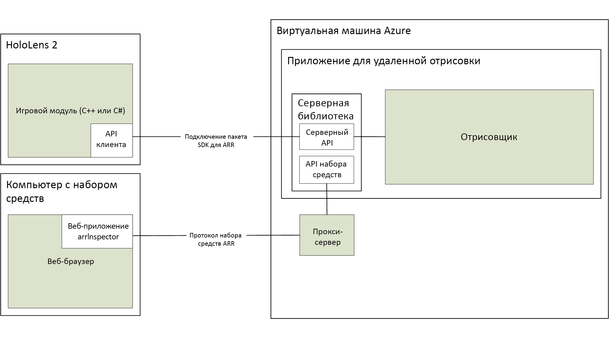

# Сведения об Удаленной отрисовке Azure

*Удаленная отрисовка Azure* (ARR) — это служба, которая позволяет визуализировать высококачественное интерактивное трехмерное содержимое в облаке и передавать его в режиме реального времени на устройства, такие как HoloLens 2.

Мобильные устройства не имеют достаточной вычислительной мощности для визуализации сложных моделей. Тем не менее, во многих случаях любое снижение точности визуальных элементов неприемлемо. На следующем снимке экрана модель полностью сравнивается с моделью, которая была упрощена с помощью распространенного средства создания содержимого:

Уменьшенная модель состоит из приблизительно 200 000 треугольников (включая подробные внутренние части), при этом исходная модель содержала более 18 млн треугольников.

*Удаленная отрисовка* решает эту проблему, перемещая рабочую нагрузку отрисовки в высокопроизводительные графические процессоры в облаке. Облачный обработчик графики визуализирует изображение, кодирует его как видеопоток и транслирует на целевое устройство.

## Гибридная отрисовка

В большинстве приложений недостаточно лишь преобразовать сложную модель для просмотра. Также необходим пользовательский интерфейс для предоставления пользователю функциональных возможностей. Удаленная отрисовка Azure не требует принудительного использования отдельной платформы пользовательского интерфейса, вместо этого она поддерживает *гибридную отрисовку*. Это означает, что вы можете отображать элементы на устройстве с помощью выбранного метода, например [MRTK](https://microsoft.github.io/MixedRealityToolkit-Unity/Documentation/GettingStartedWithTheMRTK.html).

В конце кадра Удаленная отрисовка Azure автоматически объединяет локально подготовленное содержимое с удаленным изображением. Это можно сделать даже с правильным перекрытием.

## Визуализация с несколькими GPU

Некоторые модели слишком сложны для отрисовки с приемлемой для интерактивной работы частотой кадров даже в случае высокопроизводительного GPU. В особенности это распространенная проблема в случае промышленной визуализации. Чтобы отодвинуть это ограничение, Удаленная отрисовка Azure может распределить рабочую нагрузку на несколько GPU. Результаты их работы объединяются в единое изображение, делая процесс полностью прозрачным для пользователя.

## Высокоуровневая архитектура

На этой схеме показана архитектура удаленной отрисовки:

Полный цикл создания изображения состоит из следующих этапов.

1. На стороне клиента: Настройка кадра
    1. Ваш код: Пользовательский ввод обрабатывается, граф сцены обновляется
    1. Код ARR: Обновления графа сцены и ожидаемое основное расположение передаются на сервер
1. На стороне сервера: Удаленная отрисовка
    1. Модуль отрисовки распределяет отрисовку по доступным GPU
    1. Выходные данные нескольких GPU собираются в единое изображение
    1. Изображение кодируется в поток видео и отправляется обратно клиенту
1. На стороне клиента: Завершение
    1. Ваш код: Преобразуется для просмотра необязательное локальное содержимое (пользовательский интерфейс, маркеры и т. п.)
    1. Код ARR: В "настоящее время" отрисованное локально содержимое автоматически сливается с видеопотоком

Основной проблемой является сетевая задержка. Время ожидания между отправкой запроса и получением результата обычно слишком велико для пригодных для интерактивной работы частот кадров. Поэтому в любой момент времени может передаваться сразу несколько кадров.

## Дальнейшие действия

* [Требования к системе](system-requirements.md)
* [Краткое руководство. Отрисовка модели с помощью Unity](../quickstarts/render-model.md)
